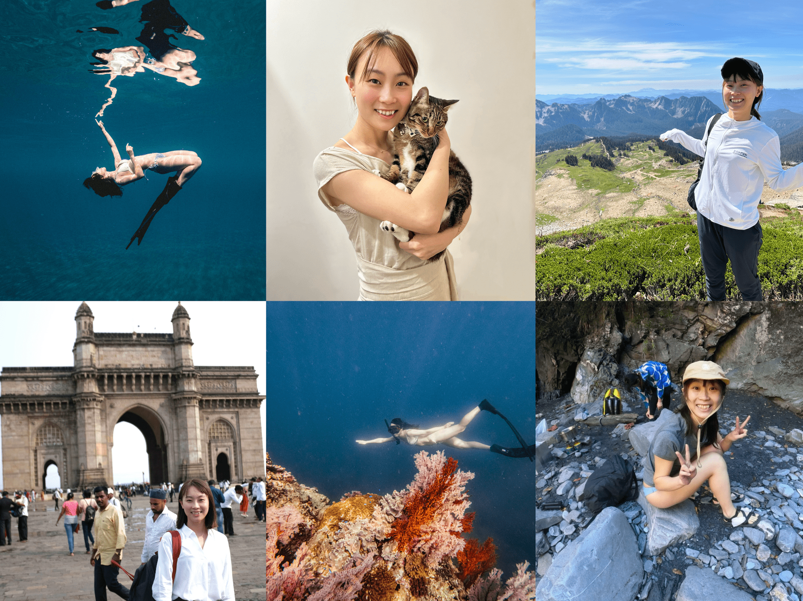
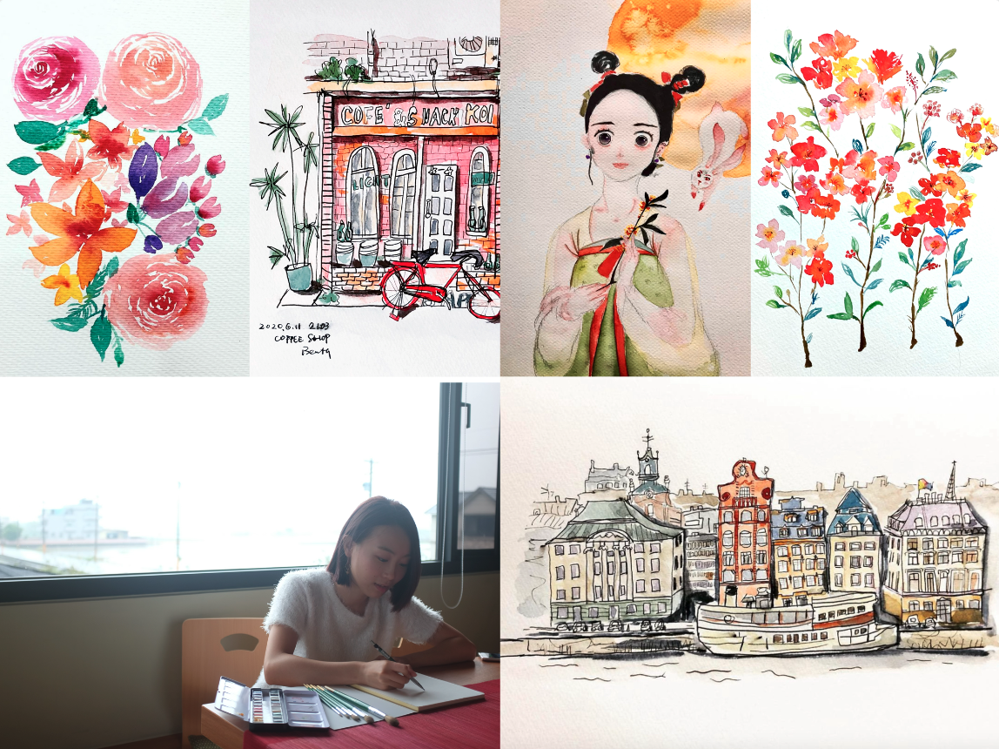

# **About My Life**

 

Hi I am **{{ site.author.name }}** :wave:, 

Growing up, I always had a deep affection for the world of books, a love that naturally led me to study Literature and History at university. Now, in a delightful twist, I find myself writing articles for various Chinese media outlets, nurturing my passion for storytelling. My career took an unexpected turn into the tech industry's marketing sector, sparking a keen interest in technology. This newfound fascination motivated me to pursue a Master's degree in Information Systems, broadening my perspectives and introducing me to new experiences.

 

 

My free time is often spent exploring the world through backpacking, a hobby that has taken me to over ten countries. My adventurous spirit doesn't stop there; I'm also drawn to the underwater world of freediving and scuba diving, where I've learned to hold my breath for up to four minutes. These experiences contrast beautifully with the comfort of home in Taiwan, where my beloved cat awaits, always ready to offer companionship and warmth.

 

 

When I'm seeking a quiet day indoors, I turn to watercolor painting. This gentle hobby brings a soothing balance to my life, allowing me to capture moments of peace and beauty on canvas.

 

