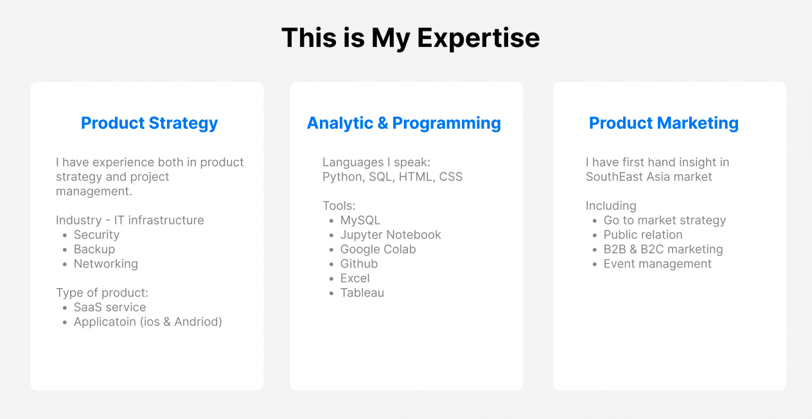

# **About Me**

Hi I am **{{ site.author.name }}** :wave:, 

I am a product manager and marketing professional with 7 years of experience in the tech industry. I have successfully designed and launched app and SaaS products. Expertise in Product Strategy, Project Management, Market Research, and Marketing Strategy (including Growth Marketing and Product Marketing) for both B2B and B2C products.

I began my career as a marketing specialist, where I handled various aspects of marketing, including B2B to B2C marketing, digital marketing, and channel marketing. As part of my job, I frequently traveled to Southeast Asia, which sparked ideas for improving our products. This ultimately led me to transfer teams and transition into the role of a product manager.

My marketing and literary background allows me to understand marketing dilemmas and think from a human perspective, and professionally, I’m able to transfer business concepts into a final product. I am in interested in exploring different products and opportunies. 🌿



